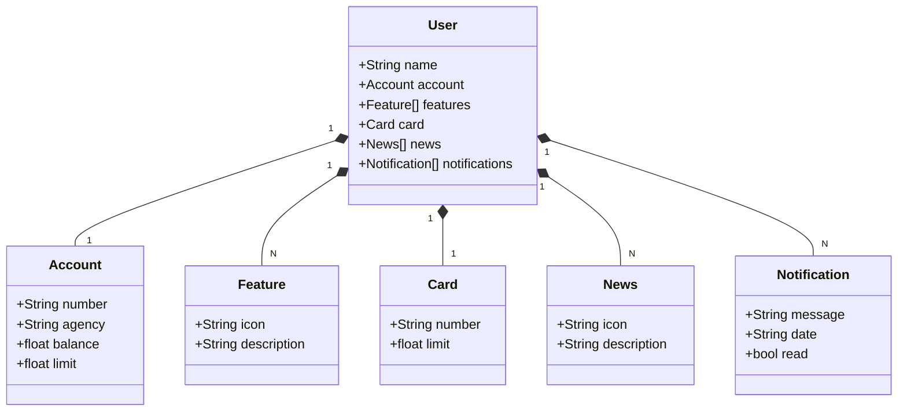

# Santander Dev Week 2025

Este projeto foi desenvolvido como parte do bootcamp **DIO + Avanade**, com foco na construção de uma API RESTful utilizando **Java** e **Spring Boot**.

## 💼 Objetivo
Simular um ambiente bancário digital, exibindo informações de usuário, conta, cartão, recursos disponíveis e notificações — seguindo boas práticas de arquitetura e organização de código.

## 🔧 Tecnologias utilizadas
- **Java 17**
- **Spring Boot**
- **Gradle**
- **VS Code**
- **Git & GitHub**

## 🚀 Funcionalidades implementadas
- Consulta de dados bancários do usuário
- Informações da conta e cartão de crédito
- Lista de funcionalidades disponíveis
- Simulação de notificações bancárias e novidades

## Diagrama de classes 

## 👩‍💻 Autora
**Raíssa Monteiro**  
Desenvolvedora em formação, apaixonada por tecnologia, back-end e criação de soluções que gerem impacto.  
📧 raissasbmonteiro@gmail.com 
🌐 [LinkedIn](https://www.linkedin.com/in/ra%C3%ADssa-monteiro-90b156226/) 

